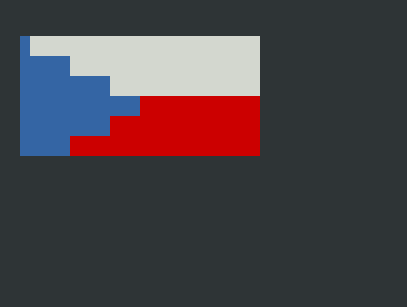
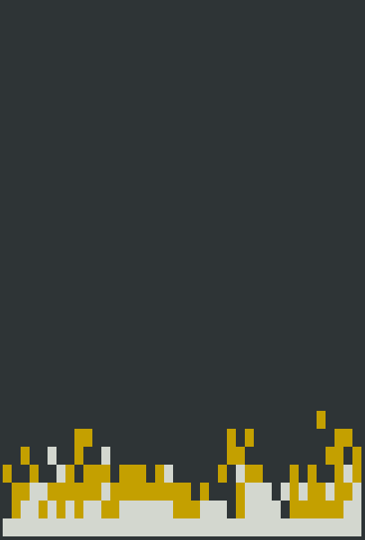
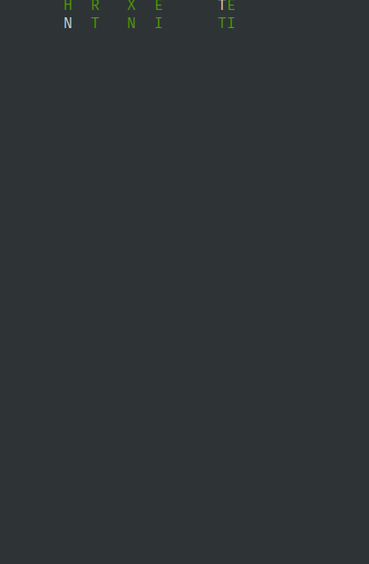

                

Tento t&#253;den si uk&#225;&#382;eme, jak rozd&#283;lit k&#243;d na&#353;ich program&#367; do men&#353;&#237;ch celk&#367;, kter&#233; pak m&#367;&#382;eme jednodu&#353;e znovuvyu&#382;&#237;t, pomoc&#237; funkc&#237;.

Ve&#353;ker&#233; informace o u&#269;ivu p&#345;edm&#283;tu naleznete v online <a href="https://mrlvsb.github.io/upr-skripta">skriptech</a>.

<strong>Pokud byste si s &#269;&#237;mkoliv nev&#283;d&#283;li rady, nev&#225;hejte kdykoliv napsat na <a href="https://discord-fei.vsb.cz/">&#353;koln&#237; Discord</a> do m&#237;stnosti pro <a href="https://discord.com/channels/631124326522945546/1058360071567978496/threads/1058362395896062042">UPR</a>.</strong>

<h2 id="kapitoly-ve-skriptech-k-t&#233;to-lekci">Kapitoly ve skriptech k t&#233;to lekci</h2>
<ul>
<li><a href="https://mrlvsb.github.io/upr-skripta/c/funkce/funkce.html">Funkce</a></li>
</ul>

&#218;lohy k procvi&#269;en&#237; naleznete <a href="https://mrlvsb.github.io/upr-skripta/ulohy/funkce.html">zde</a>.

<h2 id="dom&#225;c&#237;-&#250;loha">Dom&#225;c&#237; &#250;loha</h2>

<strong>Odevzd&#225;vejte jeden soubor s p&#345;&#237;ponou <code>.c</code>. Soubor <code>drawing.h</code> nenahr&#225;vejte, Kelvin si jej dopln&#237; s&#225;m. &#218;lohy odevzdan&#233; v archivu <code>.rar</code> nebo s jinou p&#345;&#237;ponou nebudou akceptov&#225;ny.</strong>

&#218;loha na tento t&#253;den bude trochu speci&#225;ln&#237;. Vyzkou&#353;&#237;me si, jak vykreslit barevnou grafiku (ne pouze klasick&#253; text) do termin&#225;lu pomoc&#237; tzv. <a href="https://en.wikipedia.org/wiki/ANSI_escape_code">ANSI escape sekvenc&#237;</a>.

Pokud na v&#253;stup programu vyp&#237;&#353;ete ur&#269;it&#233; speci&#225;ln&#237; sekvence byt&#367;, a pou&#382;ijete pro jejich vykreslen&#237; termin&#225;l, kter&#253; je podporuje, m&#367;&#382;ete pomoc&#237; t&#283;chto sekvenc&#237; termin&#225;l ovl&#225;dat, nap&#345;. h&#253;bat kurzorem, nastavovat barvu pozad&#237; vykreslovan&#233;ho textu, vy&#269;istit obsah termin&#225;lu atd. Nap&#345;&#237;klad, pokud v&#225;&#353; program vyp&#237;&#353;e sekvenci byt&#367; <code>\x1b[41;1m</code>, tak se termin&#225;l p&#345;epne do stavu, kdy n&#225;sleduj&#237;c&#237; v&#253;pisy znak&#367; budou m&#237;t &#269;erven&#233; pozad&#237;. T&#283;mito speci&#225;ln&#237;mi ANSI sekvencemi tak m&#367;&#382;ete ovl&#225;dat, jak bude termin&#225;lov&#253; v&#253;stup vypadat, a m&#367;&#382;ete d&#237;ky tomu vykreslovat v&#283;ci mnohem zaj&#237;mav&#283;j&#353;&#237;m zp&#367;sobem, ne&#382; kdy&#382; pouze klasicky vypisujete znaky zleva doprava, &#345;&#225;dek po &#345;&#225;dku (tak, jako v minul&#233; &#250;loze).

C&#237;lem cvi&#269;en&#237; je vytvo&#345;it program, ve kter&#233;m si procvi&#269;&#237;te vyu&#382;it&#237; funkc&#237; (v pozd&#283;j&#353;&#237;ch &#250;loh&#225;ch budete funkce pou&#382;&#237;vat u&#382; automaticky v podstat&#283; neust&#225;le). Sna&#382;te se tedy sv&#367;j k&#243;d rozumn&#283; rozd&#283;lit do funkc&#237;, abyste k&#243;d, kter&#253; se d&#225; znovu vyu&#382;&#237;t, nem&#283;li v programu neust&#225;le zkop&#237;rovan&#253;. Identifikujte &#269;asto se opakuj&#237;c&#237; kusy k&#243;du (vykreslen&#237; &#269;&#225;ry, vykreslen&#237; &#269;tverce atd.) a ud&#283;lejte z nich funkce.

Na rozd&#283;len&#237; programu do funkc&#237; budeme br&#225;t ohled p&#345;i hodnocen&#237; &#250;lohy (to ale neznamen&#225;, &#382;e &#269;&#237;m v&#237;ce funkc&#237; = t&#237;m v&#237;ce bod&#367; :) Mus&#237; to d&#225;vat smysl.).

<h3 id="&#353;ablona">&#352;ablona</h3>

<strong>Nachystali jsme pro v&#225;s <a href="/task/UPR/2023W/BER0134/ex03_functions/asset/template/drawing.h">soubor s funkcemi pro kreslen&#237;</a></strong>, ve kter&#233;m m&#225;te k dispozici sadu p&#345;edp&#345;ipraven&#253;ch funkc&#237; ur&#269;en&#253;ch pro kreslen&#237; do termin&#225;lu. Vyu&#382;ijte tyto funkce v &#250;loh&#225;ch popsan&#253;ch n&#237;&#382;e.

Abyste mohli funkce z tohoto souboru jednodu&#353;e vyu&#382;&#237;t, tak soubor <code>drawing.h</code> p&#345;esu&#328;te do stejn&#233; slo&#382;ky, ve kter&#233; je v&#225;&#353; zdrojov&#253; soubor (nap&#345;. <code>main.c</code>), a pot&#233; jej do va&#353;eho k&#243;du vlo&#382;te &#345;&#225;dkem <code>#include "drawing.h"</code>. Zde je &#353;ablona, ze kter&#233; m&#367;&#382;ete vyj&#237;t:

<pre class="c"><code>#include "drawing.h"

int main() {
  // Keep this line here
  clear_screen();

  // Load the input - what should be drawn.
  int drawing = 0;
  scanf("%d", &amp;drawing);

  // Put your drawing code here
  set_blue_color();
  draw_pixel();
  move_right();

  set_red_color();
  printf("Hello UPR");

  set_blue_color();
  draw_pixel();

  // Keep this line here
  end_drawing();

  return 0;
}</code></pre>
<h3 id="jak-funguje-kreslen&#237;">Jak funguje kreslen&#237;?</h3>

Na za&#269;&#225;tku programu je kurzor nastaven na prvn&#237; &#345;&#225;dek a prvn&#237; sloupec (&#8220;vlevo naho&#345;e&#8221;), a kresl&#237;c&#237; plocha se nastav&#237; na ur&#269;en&#253; po&#269;et &#345;&#225;dk&#367; (prom&#283;nn&#225; <code>canvas_height</code> v souboru <code>drawing.h</code>). V r&#225;mci t&#233;to plochy m&#367;&#382;ete kreslit (&#353;&#237;&#345;ka plochy je d&#225;na &#353;&#237;&#345;kou va&#353;eho termin&#225;lu, nap&#345;. 80 znak&#367;). Kdy&#382; nastav&#237;te n&#283;jakou barvu pozad&#237; (nap&#345;. zavol&#225;n&#237;m funkce <code>set_blue_color</code>), a pot&#233; vykresl&#237;te &#8220;pixel&#8221; (zavol&#225;n&#237;m funkce <code>draw_pixel</code>), tak se v termin&#225;lu vybarv&#237; modr&#253; obd&#233;ln&#237;&#269;ek na dan&#233; pozici kurzoru. Pot&#233; m&#367;&#382;ete kurzor posunout na jinou pozici pomoc&#237; funkc&#237; <code>move_right</code>, <code>move_down</code> atd., a znovu kreslit. Pokud zkombinujete kreslen&#237; s cykly, podm&#237;nkami a funkcemi, tak m&#367;&#382;ete vykreslit pom&#283;rn&#283; zaj&#237;mav&#233; tvary. Krom&#283; vykreslov&#225;n&#237; &#8220;pixel&#367;&#8221; (co&#382; jsou pouze mezery, se zabarven&#253;m pozad&#237;m) m&#367;&#382;ete tak&#233; kreslit libovoln&#233; znaky, klasicky pomoc&#237; <code>printf</code>.

<h3 id="zad&#225;n&#237;">Zad&#225;n&#237;</h3>

Ka&#382;dou z &#250;loh n&#237;&#382;e vlo&#382;te do samostatn&#233; funkce a tyto funkce pot&#233; volejte ve funkci <code>main</code>. Funkc&#237;m p&#345;idejte parametry, aby &#353;ly jednotliv&#233; &#250;tvary vykreslit v r&#367;zn&#253;ch velikostech, podle toho, s jak&#253;mi argumenty je funkce vol&#225;na.

Pro vykreslov&#225;n&#237; pou&#382;&#237;vejte funkci <code>draw_pixel</code> (vykresl&#237; &#8220;pixel&#8221;) v kombinaci s <code>set_xxx_color</code>.

<ul>
<li>
<strong>P&#345;eru&#353;ovan&#225; &#269;&#225;ra</strong> Napi&#353;te funkci, kter&#225; vykresl&#237; p&#345;eru&#353;ovanou &#269;&#225;ru o d&#233;lce dan&#233; parametrem funkce. &#268;&#225;ra bude v&#382;dy obsahovat vypln&#283;n&#253; barevn&#253; &#8220;pixel&#8221;, pot&#233; pr&#225;zdn&#233; m&#237;sto, pixel, pr&#225;zdn&#233; m&#237;sto atd. Zadan&#225; d&#233;lka bude ud&#225;vat po&#269;et vypln&#283;n&#253;ch pixel&#367;.
</li>
<li>
<strong>Schody</strong> Napi&#353;te funkci, kter&#225; vykresl&#237; &#8220;schody&#8221;, tj. st&#345;&#237;daj&#237;c&#237; se horizont&#225;ln&#237; a vertik&#225;ln&#237; &#269;&#225;ry. Parametrem funkce bude po&#269;et schod&#367;.
</li>
<li>
<strong>Vykreslen&#237; kv&#283;tiny</strong> Napi&#353;te funkci, kter&#225; vykresl&#237; n&#283;jakou kv&#283;tinu o rozm&#283;rech zadan&#253;ch dv&#283;ma parametry (po&#269;et pixel&#367;, kter&#233; bude zab&#237;rat &#353;&#237;&#345;ka kv&#283;tiny, a po&#269;et pixel&#367;, kter&#233; bude zab&#237;rat v&#253;&#353;ka rostliny) na sou&#269;asn&#233; pozici kurzoru. To, jak bude kv&#283;tina vypadat, je na v&#225;s, m&#367;&#382;ete nakreslit nap&#345;. slune&#269;nici nebo r&#367;&#382;i, ale zkuste rostlin&#283; v&#382;dy p&#345;idat zelen&#253; stonek, kter&#253; povede uprost&#345;ed jej&#237; doln&#237; &#269;&#225;sti. Fantazii se meze nekladou :)
</li>
<li>
<strong>Vykreslen&#237; louky</strong> Napi&#353;te funkci, kter&#225; vykresl&#237; louku obsahuj&#237;c&#237; zadan&#253; po&#269;et &#345;&#225;dk&#367; a po&#269;et sloupc&#367; s kv&#283;tinami (po&#269;ty budou d&#225;ny parametry funkce). Kv&#283;tiny um&#237;st&#283;te do m&#345;&#237;&#382;ky, mezi jednotliv&#253;mi &#345;&#225;dky a sloupci ud&#283;lejte mezery. P&#345;i tvorb&#283; t&#233;to funkce vyu&#382;ijte funkci z p&#345;edchoz&#237; &#250;lohy na vykreslen&#237; kv&#283;tiny!
</li>
<li>

<strong>Animace</strong> Pou&#382;ijte funkci <code>animate</code>, abyste vytvo&#345;ili dojem animovan&#233;ho vykreslen&#237;. Tato funkce na chv&#237;li usp&#237; v&#225;&#353; program. Pokud tedy v&#382;dy n&#283;co vykresl&#237;te, pak program usp&#237;te, znovu n&#283;co vykresl&#237;te atd. (v cyklu), tak uvid&#237;te animaci. Pokud po usp&#225;n&#237; vy&#269;ist&#237;te obrazovku, tak m&#367;&#382;ete vykreslit pohybuj&#237;c&#237; se obrazce. M&#367;&#382;ete t&#345;eba rozanimovat vykreslov&#225;n&#237; schod&#367; nebo louky. Zkuste vymyslet n&#283;jakou zaj&#237;mavou animaci a vykreslit ji.

P&#345;&#237;klad:

</li>
<li>

<strong>Bonus</strong>: zkuste vykreslit v &#250;loze s animac&#237; n&#283;co opravdu zaj&#237;mav&#233;ho. Nap&#345;&#237;klad h&#253;baj&#237;c&#237; se &#269;eskou vlajku:

ohe&#328; ze hry <a href="https://fabiensanglard.net/doom_fire_psx/">Doom</a>:

nebo t&#345;eba <a href="https://en.wikipedia.org/wiki/Matrix_digital_rain">d&#233;&#353;&#357; z Matrixu</a>:

</li>
</ul>

<strong>Aby &#353;el v&#225;&#353; program vizu&#225;ln&#283; otestovat na Kelvinu, tak napi&#353;te funkci <code>main</code> tak, aby na za&#269;&#225;tku na&#269;etla ze vstupu programu jedno &#269;&#237;slo (viz k&#243;d se <code>scanf</code> v <a href="#%C5%A1ablona">&#353;ablon&#283;</a>, podobn&#283; jako u minul&#233; &#250;lohy), a v z&#225;vislosti na tomto &#269;&#237;sle vykreslete odpov&#237;daj&#237;c&#237; &#8220;sc&#233;nu&#8221;</strong>:

<ul>
<li>Pokud bude &#269;&#237;slo <code>0</code>, vykreslete n&#283;kolik p&#345;eru&#353;ovan&#253;ch &#269;ar, na r&#367;zn&#253;ch pozic&#237;ch a s r&#367;znou barvou.</li>
<li>Pokud bude &#269;&#237;slo <code>1</code>, vykreslete n&#283;kolik schod&#367;, s r&#367;znou d&#233;lkou a r&#367;znou barvou.</li>
<li>Pokud bude &#269;&#237;slo <code>2</code>, vykreslete n&#283;kolik kv&#283;tin, na r&#367;zn&#253;ch pozic&#237;ch a s r&#367;zn&#253;mi rozm&#283;ry.</li>
<li>Pokud bude &#269;&#237;slo <code>3</code>, vykreslete louku kv&#283;tin s dv&#283;ma &#345;&#225;dky a n&#283;kolika sloupci.</li>
<li>Pokud bude &#269;&#237;slo <code>4</code>, vykreslete n&#283;jakou zaj&#237;mavou animaci :)</li>
</ul>

<strong>P&#345;i vykreslov&#225;n&#237; sc&#233;n v <code>main</code>u volejte funkce pro vykreslov&#225;n&#237; kv&#283;tiny/louky/&#269;&#225;ry/schod&#367;, kter&#233; byly pops&#225;ny v&#253;&#353;e!</strong>

Na Kelvinu pak v z&#225;lo&#382;ce <a href="#result">Result</a> uvid&#237;te v&#253;sledky va&#353;eho programu pro vstupy <code>0</code> a&#382; <code>4</code>. Na Kelvinu bude v&#382;dy v&#253;&#353;ka termin&#225;lu pouze 20 pixel&#367;, tak&#382;e se sna&#382;te kreslit sp&#237;&#353;e do &#353;&#237;&#345;ky, ne&#382; do v&#253;&#353;ky, a&#357; nen&#237; v&#253;stup o&#345;ezan&#253;. M&#367;&#382;ete p&#345;izp&#367;sobit rozm&#283;ry kreslen&#237; podle prom&#283;nn&#233; <code>canvas_height</code>, kter&#225; bude nastavena na Kelvinu na hodnotu <code>20</code>. Pro vstup <code>4</code> (animace) pob&#283;&#382;&#237; program na Kelvinu maxim&#225;ln&#283; 5 vte&#345;in.

<h3 id="obecn&#233;-pozn&#225;mky">Obecn&#233; pozn&#225;mky</h3>
<ul>
<li>T&#237;m, &#382;e v&#225;&#353; program bude vypisovat ANSI sekvence, kter&#233; upravuj&#237; stav termin&#225;lu, je mo&#382;n&#233;, &#382;e se v&#225;&#353; termin&#225;l ob&#269;as dostane do dost zvl&#225;&#353;tn&#237;ho stavu. V takov&#233;m p&#345;&#237;pad&#283; bu&#271; spus&#357;te v&#225;&#353; program znovu, spus&#357;te p&#345;&#237;kaz <code>reset</code> pro resetov&#225;n&#237; stavu termin&#225;lu, nebo rovnou cel&#253; termin&#225;l restartujte. P&#345;ed spu&#353;t&#283;n&#237;m programu je tak&#233; vhodn&#233; vy&#269;istit obsah termin&#225;lu (obvykle se toho d&#225; dos&#225;hnout pomoc&#237; kl&#225;vesov&#233; zkratky <code>Ctrl + L</code>).</li>
<li>
<strong>Tento &#250;kol s nejv&#283;t&#353;&#237; pravd&#283;podobnost&#237; bude vy&#382;adovat pou&#382;it&#237; Linuxu nebo WSL.</strong> Jednak funkce pro animaci pou&#382;&#237;v&#225; specifickou Linux funkci na usp&#225;n&#237; programu, a tak&#233; samotn&#233; ANSI sekvence obvykle na Windows nemaj&#237; zrovna skv&#283;lou podporu.</li>
<li>P&#345;i kreslen&#237; si mus&#237;te v&#382;dycky uv&#283;domovat, na jak&#233; pozici m&#225;te kurzor v termin&#225;lu. Pokud ve funkci vykresl&#237;te n&#283;jak&#253; obrazec, m&#367;&#382;e b&#253;t vhodn&#233; na konci funkce kurzor vyresetovat na p&#367;vodn&#237; pozici, p&#345;&#237;padn&#283; jej posunout na n&#283;jakou rozumnou pozici (nap&#345;. na konec stonku u rostliny). Pokud byste cht&#283;li pozici kurzoru vizu&#225;ln&#283; odladit, tak zakomentujte vol&#225;n&#237; funkce <code>hide_cursor</code> ve funkci <code>clear_screen</code> a pou&#382;ijte funkci <code>animate</code>, aby kurzor za&#269;al blikat. P&#345;&#237;padn&#283; m&#367;&#382;ete vykreslit nap&#345;. pixel &#269;ervenou barvou a pot&#233; ukon&#269;it program. Na m&#237;st&#283; vykreslen&#233;ho &#269;erven&#233;ho pixelu se pak naposledy nach&#225;zel kurzor.</li>
</ul>
<h3 id="kontrola-pam&#283;&#357;ov&#253;ch-chyb">Kontrola pam&#283;&#357;ov&#253;ch chyb</h3>

Nezapom&#237;nejte p&#345;ekl&#225;dat v&#225;&#353; program s <a href="https://mrlvsb.github.io/upr-skripta/prostredi/ladeni.html#address-sanitizer">Address sanitizerem</a>, p&#345;&#237;padn&#283; ho spou&#353;t&#283;t pod <a href="https://mrlvsb.github.io/upr-skripta/prostredi/ladeni.html#valgrind">Valgrindem</a>. M&#367;&#382;e v&#225;m to pomoc naleznout p&#345;&#237;padn&#233; chyby (nedefinovan&#233; chov&#225;n&#237;) ve va&#353;ich programech.
