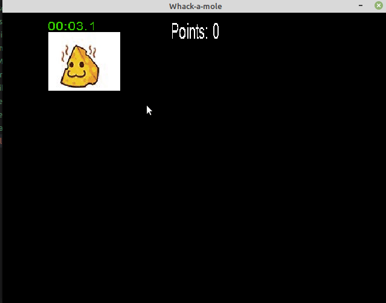
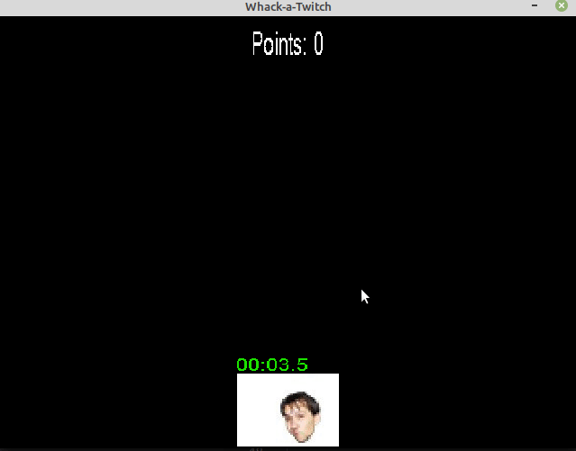

Toto je bonusov&#225; &#250;loha, na kter&#233; m&#367;&#382;ete nasb&#237;rat body nav&#237;c do UPR.

Ve&#353;ker&#233; informace o u&#269;ivu p&#345;edm&#283;tu naleznete v online <a href="https://mrlvsb.github.io/upr-skripta">skriptech</a>.

<strong>Pokud byste si s &#269;&#237;mkoliv nev&#283;d&#283;li rady, nev&#225;hejte kdykoliv napsat na <a href="https://discord-fei.vsb.cz/">&#353;koln&#237; Discord</a> do m&#237;stnosti pro <a href="https://discord.com/channels/631124326522945546/1058360071567978496/threads/1058362395896062042">UPR</a>.</strong>

<h2 id="kapitoly-ve-skriptech-k-t&#233;to-lekci">Kapitoly ve skriptech k t&#233;to lekci</h2>
<ul>
<li><a href="https://mrlvsb.github.io/upr-skripta/c/aplikovane_ulohy/sdl.html">SDL</a></li>
<li><a href="https://mrlvsb.github.io/upr-skripta/ruzne/dynamicky_rostouci_pole.html">Dynamicky rostouc&#237; pole</a></li>
<li><a href="https://mrlvsb.github.io/upr-skripta/ruzne/nahodna_cisla.html">Generov&#225;n&#237; n&#225;hodn&#253;ch &#269;&#237;sel</a></li>
</ul>

&#218;lohy k procvi&#269;en&#237; naleznete <a href="https://mrlvsb.github.io/upr-skripta/ulohy/sdl.html">zde</a>.

<h2 id="&#250;loha">&#218;loha</h2>

<strong>Odevzd&#225;vejte Odevzd&#225;vejte jeden soubor s p&#345;&#237;ponou <code>.c</code>. &#218;lohy odevzdan&#233; v archivu <code>.rar</code> nebo s jinou p&#345;&#237;ponou nebudou akceptov&#225;ny. Soubory <code>dynamic_array.h/c</code> a <code>sdl.h/c</code> nemus&#237;te nahr&#225;vat, Kelvin je automaticky p&#345;ikop&#237;ruje do slo&#382;ky s va&#353;&#237;m zdrojov&#253;m k&#243;dem.</strong>

<strong>Na &#250;loze pracujte samostatn&#283;. Pokud zjist&#237;me, &#382;e jste nepracovali na &#250;loze samostatn&#283;, budou v&#225;m ud&#283;leny z&#225;porn&#233; body, p&#345;&#237;padn&#283; budete vylou&#269;eni z p&#345;edm&#283;tu. Je zak&#225;z&#225;no sd&#237;let sv&#233; &#345;e&#353;en&#237; s ostatn&#237;mi, opisovat od ostatn&#237;ch, nechat si od ostatn&#237;ch diktovat k&#243;d a pou&#382;&#237;vat AI n&#225;stroje na psan&#237; k&#243;du (ChatGPT, Copilot atd.).</strong>

Pro&#269; zakazujeme pou&#382;it&#237; AI pro psan&#237; k&#243;du?

&#218;lohy zad&#225;van&#233; v UPR jsou svou strukturou velmi jednoduch&#233;, a daj&#237; se obvykle vy&#345;e&#353;it pomoc&#237; n&#283;kolika des&#237;tek &#345;&#225;dk&#367; k&#243;du. Dne&#353;n&#237; jazykov&#233; modely jsou schopny tyto &#250;lohy vy&#345;e&#353;it v podstat&#283; na prvn&#237; dobrou, t&#233;m&#283;&#345; nebo zcela dokonale. Pokud tedy student pouze nakop&#237;ruje zad&#225;n&#237; do AI modelu, a pot&#233; zkop&#237;ruje v&#253;sledek do Kelvina, tak se samoz&#345;ejm&#283; nic nenau&#269;&#237;. C&#237;lem UPR je nau&#269;it se pochopit z&#225;klady toho, jak funguje po&#269;&#237;ta&#269; a pam&#283;&#357;, jak funguje programovac&#237; jazyk C a jak pomoc&#237; n&#283;j vytv&#225;&#345;et jednoduch&#233; programy, a toho lze dos&#225;hnout pouze t&#237;m, &#382;e budete hodn&#283; programovat a &#345;e&#353;it hodn&#283; &#250;loh.

Probl&#233;m je v tom, &#382;e AI v&#225;m sice vy&#345;e&#353;&#237; jednoduch&#233; probl&#233;my, ale u slo&#382;it&#283;j&#353;&#237;ch &#250;loh (kter&#233; se budou vyskytovat nap&#345;. v navazuj&#237;c&#237;ch p&#345;edm&#283;tech, nebo pozd&#283;ji v pr&#225;ci) u&#382; si bu&#271; nebude v&#283;d&#283;t rady, anebo budete muset jej&#237; v&#253;stup alespo&#328; &#269;&#225;ste&#269;n&#283; upravit. A abyste mohli n&#283;co upravit, tak tomu mus&#237;te rozum&#283;t, a mus&#237;te b&#253;t schopni to nez&#225;visle vytvo&#345;it samostatn&#283;. A k tomu je pot&#345;eba j&#237;t postupn&#283;, nejprve se nau&#269;it &#345;e&#353;it jednodu&#353;&#353;&#237; &#250;lohy, a pak postupn&#283; p&#345;ech&#225;zet na slo&#382;it&#283;j&#353;&#237;. Pokud jednoduch&#233; &#250;lohy vy&#345;e&#353;&#237;te pomoc&#237; AI, a u slo&#382;it&#283;j&#353;&#237;ch AI sel&#382;e, tak nebudete v&#367;bec v&#283;d&#283;t, jak tyto slo&#382;it&#283;j&#353;&#237; &#250;lohy &#345;e&#353;it.

Z toho d&#367;vodu nedovolujeme pou&#382;&#237;vat AI v re&#382;imu &#8220;copy &amp; paste&#8221;. Pokud pou&#382;ijete AI pro &#8220;konverzaci&#8221;, nap&#345;. pro zji&#353;t&#283;n&#237;, jestli by V&#225;&#353; k&#243;d ne&#353;el zlep&#353;it, nebo jestli v n&#283;m nen&#237; chyba, tak je to v po&#345;&#225;dku. Pokud ale pouze do ChatGPT nakop&#237;rujete zad&#225;n&#237;, a pot&#233; zkop&#237;rujete vygenerovan&#253; k&#243;d, tak se opravdu nic nenau&#269;&#237;te.

 

Napi&#353;te pomoc&#237; knihovny <code>SDL</code> jednoduch&#253; klon hry <a href="https://www.youtube.com/watch?v=VoP1E9J4jpg"><code>Whack-a-Mole</code></a>.

<h3 id="postup-&#345;e&#353;en&#237;">Postup &#345;e&#353;en&#237;:</h3>
<ol type="1">
<li>Na&#269;t&#283;te tento <a href="/task/UPR/2023W/BER0134/ex_bonus_sdl/asset/assets/emojipedia.jpg">obr&#225;zek</a>, kter&#253; obsahuje <a href="https://en.wikipedia.org/wiki/Texture_atlas">encyklopedii ikon</a> s r&#367;zn&#253;mi Twitch emoji obr&#225;zky.</li>
<li>Periodicky (co <code>T</code> milisekund) v okn&#283; vytv&#225;&#345;ejte nov&#233;ho &#8220;krtka&#8221;.
<ul>
<li>Krtek se vytvo&#345;&#237; na n&#225;hodn&#233; pozici s n&#225;hodnou velikost&#237; (v rozumn&#253;ch mez&#237;ch).</li>
<li>Jako obr&#225;zek krtka pou&#382;ijte n&#225;hodnou ikonu z encyklopedie. Encyklopedie obsahuje m&#345;&#237;&#382;ku s <code>18</code> sloupci a <code>10</code> &#345;&#225;dky ikon. Mus&#237;te spo&#269;&#237;tat, jak&#225; m&#225; b&#253;t velikost a pozice zdrojov&#233;ho v&#253;&#345;ezu z encyklopedie a pou&#382;&#237;t ji p&#345;i vykreslov&#225;n&#237; pomoc&#237; funkce <a href="https://wiki.libsdl.org/SDL_RenderCopyEx"><code>SDL_RenderCopyEx</code></a>. Velikost encyklopedie m&#367;&#382;ete zjistit po na&#269;ten&#237; pomoc&#237; funkce <a href="https://wiki.libsdl.org/SDL_QueryTexture"><code>SDL_QueryTexture</code></a>.</li>
<li>Krtek bude m&#237;t &#382;ivotnost <code>4</code> vte&#345;iny. Nad krtkem se bude vykreslovat textov&#253; odpo&#269;et jeho &#382;ivotnosti. Jakmile &#382;ivotnost dos&#225;hne nuly, tak hr&#225;&#269; prohr&#225;l a hra kon&#269;&#237;. Barvu odpo&#269;tu &#382;ivotnosti m&#283;&#328;te podle toho, jak moc se bl&#237;&#382;&#237; konec odpo&#269;tu. Za&#269;n&#283;te se zelenou barvou a postupn&#283; ji m&#283;&#328;te na &#269;ervenou.</li>
</ul>
</li>
<li>Pokud u&#382;ivatel klikne lev&#253;m tla&#269;&#237;tkem my&#353;i, tak otestujte, jestli se trefil do n&#283;jak&#233;ho krtka.
<ul>
<li>Pokud ano, tak krtka odstra&#328;te ze hry, p&#345;i&#269;t&#283;te hr&#225;&#269;ovi jeden bod sk&#243;re a zmen&#353;ete trochu hodnotu <code>T</code>, aby hra byla &#269;&#237;m d&#225;l t&#237;m v&#237;ce nap&#237;nav&#283;j&#353;&#237;.</li>
</ul>
</li>
<li>Vykreslujte na obrazovce hr&#225;&#269;ovo sk&#243;re.</li>
</ol>

D&#233;lka referen&#269;n&#237;ho &#345;e&#353;en&#237; je ~200 &#345;&#225;dk&#367; (bez bonusu).

<h3 id="uk&#225;zka-fungov&#225;n&#237;-programu">Uk&#225;zka fungov&#225;n&#237; programu:</h3>

<h3 id="bonusov&#253;-&#250;kol">Bonusov&#253; &#250;kol</h3>

P&#345;idejte n&#283;jak&#253; zaj&#237;mav&#253; grafick&#253; efekt p&#345;i kliknut&#237; na krtka. Nap&#345;&#237;klad:

<h3 id="pozn&#225;mky-k-implementaci">Pozn&#225;mky k implementaci</h3>

Pro vykreslen&#237; textu budete pot&#345;ebovat n&#283;jak&#253; (<a href="https://en.wikipedia.org/wiki/TrueType">True Type</a>) font. Bu&#271; pou&#382;ijte vlastn&#237; (pak ho nezapome&#328;te nahr&#225;t do Kelvina!) nebo m&#367;&#382;ete pou&#382;&#237;t <a href="/task/UPR/2023W/BER0134/ex_bonus_sdl/asset/assets/Arial.ttf">tento soubor</a> s fontem <code>Arial</code>.

Pro ukl&#225;d&#225;n&#237; &#8220;krtk&#367;&#8221; se v&#225;m bude hodit <a href="https://mrlvsb.github.io/upr-skripta/ruzne/dynamicky_rostouci_pole.html">dynamicky rostouc&#237; pole</a>. M&#367;&#382;ete pou&#382;&#237;t n&#225;sleduj&#237;c&#237; implementaci:

<ul>
<li><a href="/task/UPR/2023W/BER0134/ex_bonus_sdl/asset/template/dynamic_array.h"><code>dynamic_array.h</code></a></li>
<li><a href="/task/UPR/2023W/BER0134/ex_bonus_sdl/asset/template/dynamic_array.c"><code>dynamic_array.c</code></a></li>
</ul>

M&#367;&#382;ete tak&#233; vyu&#382;&#237;t tyto pomocn&#233; funkce pro inicializaci <code>SDL</code>:

<ul>
<li><a href="/task/UPR/2023W/BER0134/ex_bonus_sdl/asset/template/sdl.h"><code>sdl.h</code></a></li>
<li><a href="/task/UPR/2023W/BER0134/ex_bonus_sdl/asset/template/sdl.c"><code>sdl.c</code></a></li>
</ul>

V&#353;echny tyto zdrojov&#233; soubory si m&#367;&#382;ete st&#225;hnout v <a href="/task/UPR/2023W/BER0134/ex_bonus_sdl/asset/template.tar.gz">tomto archivu</a>.

Nezapome&#328;te na za&#269;&#225;tku programu inicializovat <code>TTF</code> pomoc&#237; funkce <a href="https://wiki.libsdl.org/SDL2_ttf/TTF_Init"><code>TTF_Init</code></a>.

<h3 id="u&#382;ite&#269;n&#233;-funkce">U&#382;ite&#269;n&#233; funkce</h3>
<ul>
<li>
<a href="https://wiki.libsdl.org/SDL_image/IMG_LoadTexture"><code>IMG_LoadTexture</code></a>: na&#269;ten&#237; obr&#225;zku (textury) z disku.</li>
<li>
<a href="https://wiki.libsdl.org/SDL_QueryTexture"><code>SDL_QueryTexture</code></a>: zji&#353;t&#283;n&#237; velikosti obr&#225;zku.</li>
<li>
<a href="https://wiki.libsdl.org/SDL_RenderCopyEx"><code>SDL_RenderCopyEx</code></a>: vykreslen&#237; obr&#225;zku (textury) s danou velikost&#237; a rotac&#237; do kresl&#237;tka.</li>
<li>
<a href="https://wiki.libsdl.org/SDL_ttf/TTF_OpenFont"><code>TTF_OpenFont</code></a>: na&#269;ten&#237; fontu z disku.</li>
<li>
<a href="https://wiki.libsdl.org/SDL_PointInRect"><code>SDL_PointInRect</code></a>: zjist&#237;, jestli se zadan&#253; bod nach&#225;z&#237; uvnit&#345; obd&#233;ln&#237;ku.</li>
<li>
<a href="https://devdocs.io/c/io/fprintf"><code>snprintf</code></a>: naform&#225;tov&#225;n&#237; textu do textov&#233;ho pole.</li>
</ul>
<h3 id="p&#345;eklad-programu">P&#345;eklad programu</h3>

P&#345;eklad programu m&#367;&#382;ete prov&#233;st klasicky, jak jste zvykl&#237;, ale pokud si to chcete usnadnit, tak zkuste pou&#382;&#237;t <a href="https://mrlvsb.github.io/upr-skripta/c/automatizace_prekladu.html#cmake">CMake</a>. M&#367;&#382;ete pou&#382;&#237;t tento vzorov&#253; <a href="/task/UPR/2023W/BER0134/ex_bonus_sdl/asset/template/CMakeLists.txt"><code>CMakeLists.txt</code> soubor</a>.

N&#225;vod, jak p&#345;elo&#382;it program pomoc&#237; CMake:

<ol type="1">
<li>

Nainstalujte CMake:

<pre class="bash"><code>$ sudo apt update
$ sudo apt install cmake</code></pre>
</li>
<li>
Vytvo&#345;te soubor <code>CMakeLists.txt</code> v adres&#225;&#345;i s va&#353;imi zdrojov&#253;mi soubory dle <a href="/task/UPR/2023W/BER0134/ex_bonus_sdl/asset/template/CMakeLists.txt">vzoru</a>.
</li>
<li>

Vytvo&#345;te adres&#225;&#345;, do kter&#233;ho se v&#225;&#353; program p&#345;elo&#382;&#237;. Spus&#357;te z n&#237; <code>cmake</code> s cestou k adres&#225;&#345;i s <code>CMakeLists.txt</code>:

<pre class="bash"><code>$ mkdir build
$ cd build
$ cmake ..</code></pre>
</li>
<li>

Nyn&#237; ve slo&#382;ce build m&#367;&#382;ete po ka&#382;d&#233; zm&#283;n&#283; zdrojov&#253;ch soubor&#367; spustit p&#345;&#237;kaz <code>make</code>, kter&#253; v&#225;&#353; program p&#345;elo&#382;&#237;:

<pre class="bash"><code>$ make</code></pre>
</li>
</ol>

Pro automatick&#253; p&#345;eklad ve VSCode m&#367;&#382;ete pou&#382;&#237;t <a href="https://code.visualstudio.com/docs/cpp/cmake-linux">CMake plugin</a>. Nainstalujte plugin, otev&#345;ete adres&#225;&#345; s <code>CMakeLists.txt</code> a program pak spus&#357;te pomoc&#237; <code>Ctrl + F5</code>.

<h3 id="kontrola-pam&#283;&#357;ov&#253;ch-chyb">Kontrola pam&#283;&#357;ov&#253;ch chyb</h3>

P&#345;i p&#345;ekladu pou&#382;&#237;vejte <a href="https://mrlvsb.github.io/upr-skripta/prostredi/ladeni.html#address-sanitizer">Address sanitizer</a> nebo <a href="https://mrlvsb.github.io/upr-skripta/prostredi/ladeni.html#valgrind">Valgrind</a>, abyste mohli rychle odhalit (t&#233;m&#283;&#345; nevyhnuteln&#233;) <a href="https://mrlvsb.github.io/upr-skripta/caste_chyby/pametove_chyby.html">pam&#283;&#357;ov&#233; chyby</a>.

P&#345;i pou&#382;it&#237; knihovny <code>SDL</code> se m&#367;&#382;e st&#225;t, &#382;e Address sanitizer ohl&#225;s&#237; n&#283;jak&#233; memory leaky, kter&#233; nebudou souviset s va&#353;&#237;m programem. Ty m&#367;&#382;ete ignorovat.

