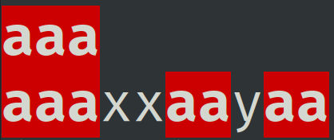

Tento t&#253;den si uk&#225;&#382;eme, jak m&#367;&#382;eme v jazyce <em>C</em> otev&#237;rat, vytv&#225;&#345;et, &#269;&#237;st a zapisovat soubory s textov&#253;m k&#243;dov&#225;n&#237;m na disku.

Ve&#353;ker&#233; informace o u&#269;ivu p&#345;edm&#283;tu naleznete v online <a href="https://mrlvsb.github.io/upr-skripta">skriptech</a>.

<strong>Pokud byste si s &#269;&#237;mkoliv nev&#283;d&#283;li rady, nev&#225;hejte kdykoliv napsat na <a href="https://discord-fei.vsb.cz/">&#353;koln&#237; Discord</a> do m&#237;stnosti pro <a href="https://discord.com/channels/631124326522945546/1058360071567978496/threads/1058362395896062042">UPR</a>.</strong>

<h2 id="kapitoly-ve-skriptech-k-t&#233;to-lekci">Kapitoly ve skriptech k t&#233;to lekci</h2>
<ul>
<li><a href="https://mrlvsb.github.io/upr-skripta/c/soubory/soubory.html">Soubory</a></li>
<li><a href="https://mrlvsb.github.io/upr-skripta/ruzne/funkce_main.html#vstupn%C3%AD-parametry-funkce-main">Parametry p&#345;&#237;kazov&#233; &#345;&#225;dky</a></li>
</ul>

&#218;lohy k procvi&#269;en&#237; naleznete <a href="https://mrlvsb.github.io/upr-skripta/ulohy/soubory.html">zde</a>.

<h2 id="dom&#225;c&#237;-&#250;loha">Dom&#225;c&#237; &#250;loha</h2>

<strong>Odevzd&#225;vejte jeden soubor s p&#345;&#237;ponou <code>.c</code>. &#218;lohy odevzdan&#233; v archivu <code>.rar</code> nebo s jinou p&#345;&#237;ponou nebudou akceptov&#225;ny.</strong>

<strong>Na &#250;loze pracujte samostatn&#283;. Pokud zjist&#237;me, &#382;e jste nepracovali na &#250;loze samostatn&#283;, budou v&#225;m ud&#283;leny z&#225;porn&#233; body, p&#345;&#237;padn&#283; budete vylou&#269;eni z p&#345;edm&#283;tu. Je zak&#225;z&#225;no sd&#237;let sv&#233; &#345;e&#353;en&#237; s ostatn&#237;mi, opisovat od ostatn&#237;ch, nechat si od ostatn&#237;ch diktovat k&#243;d a pou&#382;&#237;vat AI n&#225;stroje na psan&#237; k&#243;du (ChatGPT, Copilot atd.).</strong>

Tento t&#253;den si zkus&#237;te napsat zjednodu&#353;enou verzi Unixov&#233;ho programu <a href="https://cs.wikipedia.org/wiki/Grep"><code>grep</code></a>, kter&#253; slou&#382;&#237; k vyhled&#225;v&#225;n&#237; textu v souborech. Program obdr&#382;&#237; cestu ke vstupn&#237;mu souboru a hledan&#253; text pomoc&#237; <a href="https://mrlvsb.github.io/upr-skripta/ruzne/funkce_main.html#vstupn%C3%AD-parametry-funkce-main">parametr&#367; p&#345;&#237;kazov&#233; &#345;&#225;dky</a>. Pot&#233; projde vstupn&#237; soubor &#345;&#225;dek po &#345;&#225;dku, a vyp&#237;&#353;e v&#353;echny &#345;&#225;dky, kter&#233; obsahuj&#237; hledan&#253; text.

Program by se m&#283;l chovat takto:

<ol type="1">
<li>

Program na&#269;te pomoc&#237; <a href="https://mrlvsb.github.io/upr-skripta/ruzne/funkce_main.html#vstupn%C3%AD-parametry-funkce-main">parametr&#367; p&#345;&#237;kazov&#233; &#345;&#225;dky</a> dva povinn&#233; parametry, a dva nepovinn&#233; parametry (&#8220;flagy&#8221;):

<ul>
<li>Prvn&#237; povinn&#253; parametr obsahuje cestu ke vstupn&#237;mu souboru (<code>input-path</code>)</li>
<li>Druh&#253; povinn&#253; parametr obsahuje hledan&#253; text (<code>needle</code>)</li>
<li>Nepovinn&#253; parametr <code>-i</code> ud&#225;v&#225;, &#382;e vyhled&#225;v&#225;n&#237; m&#225; ignorovat velikost p&#237;smen</li>
<li>Nepovinn&#253; parametr <code>-o &lt;output&gt;</code> ud&#225;v&#225;, &#382;e nalezen&#233; &#345;&#225;dky maj&#237; b&#253;t vyps&#225;ny do souboru <code>&lt;output&gt;</code>, m&#237;sto do standardn&#237;ho v&#253;stupu</li>
</ul>

Pravidla pro parsov&#225;n&#237; parametr&#367;:

<ul>
<li>Ka&#382;d&#253; nepovinn&#253; parametr se m&#367;&#382;e vyskytnout pouze jednou. Pokud se vyskytne v&#237;ckr&#225;t, vypi&#353;te chybovou hl&#225;&#353;ku (viz testy), a ukon&#269;ete program s k&#243;dem 1.</li>
<li>Za parametrem <code>-o</code> mus&#237; n&#225;sledovat cesta k programu. Pokud bude cesta chyb&#283;t, vypi&#353;te chybovou hl&#225;&#353;ku (viz testy), a ukon&#269;ete program s k&#243;dem 1.</li>
<li>Cesta ke vstupn&#237;mu souboru mus&#237; b&#253;t zad&#225;na. Pokud chyb&#237;, tak vypi&#353;te chybovou hl&#225;&#353;ku (viz testy) a ukon&#269;ete program s k&#243;dem 1.</li>
<li>Hledan&#253; text mus&#237; b&#253;t zad&#225;n. Pokud chyb&#237;, tak vypi&#353;te chybovou hl&#225;&#353;ku (viz testy) a ukon&#269;ete program s k&#243;dem 1.</li>
<li>Pokud budou zad&#225;ny v&#237;ce ne&#382; dva (povinn&#233;) parametry, tak vypi&#353;te chybovou hl&#225;&#353;ku (viz testy) a ukon&#269;ete program s k&#243;dem 1.</li>
<li>
<strong>Povinn&#233; i nepovinn&#233; parametry se mohou vyskytovat v libovoln&#233;m po&#345;ad&#237;!</strong> Prvn&#237; p&#345;edan&#253; povinn&#253; parametr v&#382;dy interpretujte jako cestu ke vstupn&#237;mu souboru, a druh&#253; p&#345;edan&#253; povinn&#253; parametr interpretuje jako hledan&#253; text.</li>
</ul>

P&#345;&#237;klady korektn&#237;ch parametr&#367;:

<pre class="console"><code>$ ./program vstup.txt foo
$ ./program vstup.txt -i foo
$ ./program -o out.txt in.txt bar
$ ./program input.txt -i baz -o output.txt</code></pre>

P&#345;&#237;klady nekorektn&#237;ch parametr&#367;:

<pre class="console"><code>$ ./program
$ ./program foo
$ ./program foo -i -o out.txt
$ ./program -i
$ ./program foo bar baz
$ ./program -i foo bar -i
$ ./program -o out.txt foo -o out.txt bar
$ ./program foo bar -o

</code></pre>

V&#237;ce p&#345;&#237;klad&#367; naleznete v testech.

</li>
<li>

Program bude na&#269;&#237;tat &#345;&#225;dky ze souboru <code>input-path</code>.

<ul>
<li>M&#367;&#382;ete p&#345;edpokl&#225;dat, &#382;e vstupn&#237; soubor bude v&#382;dy existovat, nemus&#237;te &#345;e&#353;it chybu p&#345;i jeho otev&#345;en&#237;.</li>
<li>Ka&#382;d&#253; &#345;&#225;dek bude m&#237;t max. 100 znak&#367; (v&#269;etn&#283; znaku od&#345;&#225;dkov&#225;n&#237;).</li>
</ul>
</li>
<li>

Pokud se v &#345;&#225;dku vyskytuje &#345;et&#283;zec <code>needle</code>, tak cel&#253; tento &#345;&#225;dek vypi&#353;te na standardn&#237; v&#253;stup (pokud nebyl zad&#225;n nepovinn&#253; parametr <code>-o</code>) anebo do souboru na cest&#283; zadan&#233; za parametrem <code>-o</code>.

<ul>
<li>Pokud byl p&#345;ed&#225;n parametr <code>-i</code>, tak p&#345;i kontrole v&#253;skytu &#345;et&#283;zce ignorujte velikost p&#237;smen (<code>x</code> a <code>X</code> pokl&#225;dejte za stejn&#233; p&#237;smeno).</li>
<li>Neotev&#237;rejte v&#253;stupn&#237; soubor neust&#225;le dokola. Pokud m&#225;te vypisovat nalezen&#233; &#345;&#225;dky do souboru, tak jej otev&#345;ete jednou na za&#269;&#225;tku programu, a pot&#233; ho uzav&#345;ete t&#283;sn&#283; p&#345;ed koncem programu.</li>
</ul>
</li>
</ol>
<h3 id="pozn&#225;mky">Pozn&#225;mky</h3>
<ul>
<li>Pou&#382;it&#237; <a href="https://mrlvsb.github.io/upr-skripta/c/pole/staticka_pole.html#konstantn%C3%AD-velikost-statick%C3%A9ho-pole">VLA</a> je zak&#225;z&#225;no.</li>
<li>P&#345;i pr&#225;ci s &#345;et&#283;zci budete nar&#225;&#382;et na pam&#283;&#357;ov&#233; chyby. Pou&#382;&#237;vejte <a href="#kontrola-pam%C4%9B%C5%A5ov%C3%BDch-chyb">Address sanitizer nebo Valgrind</a>! P&#345;i &#345;e&#353;en&#237; t&#233;to &#250;lohy bude velmi u&#382;ite&#269;n&#233; vyu&#382;&#237;t <a href="https://mrlvsb.github.io/upr-skripta/prostredi/ladeni.html#krokov%C3%A1n%C3%AD">debugger</a> VSCode. I p&#345;i lad&#283;n&#237;/krokov&#225;n&#237; si m&#367;&#382;ete na vstup programu <a href="https://code.visualstudio.com/docs/editor/debugging#_redirect-inputoutput-tofrom-the-debug-target">p&#345;esm&#283;rovat</a> soubor, abyste nemuseli vstup neust&#225;le ps&#225;t ru&#269;n&#283;.</li>
</ul>

D&#233;lka referen&#269;n&#237;ho &#345;e&#353;en&#237;: ~140 &#345;&#225;dk&#367; (bez bonusu)

<h3 id="u&#382;ite&#269;n&#233;-funkce">U&#382;ite&#269;n&#233; funkce</h3>
<ul>
<li>
<a href="https://devdocs.io/c/io/fgets"><code>fgets</code></a> - na&#269;ten&#237; &#345;&#225;dku ze vstupu do &#345;et&#283;zce (pole znak&#367;).</li>
<li>
<a href="https://devdocs.io/c/io/fprintf"><code>fprintf</code></a> - vyps&#225;n&#237; form&#225;tovan&#253;ch dat do souboru.</li>
</ul>
<h3 id="bonusov&#253;-&#250;kol">Bonusov&#253; &#250;kol</h3>

Pokud budete vypisovat &#345;&#225;dky na standardn&#237; v&#253;stup, tak v&#353;echny v&#253;skyty nalezen&#233;ho textu v &#345;&#225;dc&#237;ch vypi&#353;te &#269;ervenou barvou (m&#367;&#382;ete vyu&#382;&#237;t k&#243;d pro ANSI sekvence z t&#345;et&#237;ho D&#218;). D&#225;vejte si pozor na to, abyste korektn&#283; vykreslovali i &#8220;vno&#345;en&#233; v&#253;skyty&#8221;, nap&#345;. pokud bude &#345;&#225;dek obsahovat <code>aaax</code>, a hledan&#253; text bude <code>aa</code>, tak by se m&#283;l &#345;&#225;dek vypsat takto:

<pre class="text"><code>&lt;&#269;erven&#225;&gt;aaa&lt;/&#269;erven&#225;&gt;x</code></pre>

Uk&#225;zka:

Pokud budete bonusov&#253; &#250;kol implementovat, nechejte ho v k&#243;du zakomentovan&#253;, a&#357; projdou testy na Kelvinovi, a p&#345;idejte do Kelvina koment&#225;&#345; pro sv&#233;ho cvi&#269;&#237;c&#237;ho, &#382;e m&#225;te bonus hotov&#253;.

<h3 id="testov&#225;n&#237;-programu">Testov&#225;n&#237; programu</h3>

Ze z&#225;lo&#382;ky <a href="#tests">Tests</a> si m&#367;&#382;ete st&#225;hnout v&#353;echny testovac&#237; soubory (<code>Download all tests</code>), a pot&#233; m&#367;&#382;ete v&#353;echny testy lok&#225;ln&#283; spustit pomoc&#237; p&#345;&#237;kazu

<pre class="bash"><code>$ python3 run-tests.py &lt;v&#225;&#353; bin&#225;rn&#237; soubor&gt;</code></pre>
<h3 id="kontrola-pam&#283;&#357;ov&#253;ch-chyb">Kontrola pam&#283;&#357;ov&#253;ch chyb</h3>

P&#345;i p&#345;ekladu pou&#382;&#237;vejte <a href="https://mrlvsb.github.io/upr-skripta/prostredi/ladeni.html#address-sanitizer">Address sanitizer</a> nebo <a href="https://mrlvsb.github.io/upr-skripta/prostredi/ladeni.html#valgrind">Valgrind</a>, abyste mohli rychle odhalit (t&#233;m&#283;&#345; nevyhnuteln&#233;) <a href="https://mrlvsb.github.io/upr-skripta/caste_chyby/pametove_chyby.html">pam&#283;&#357;ov&#233; chyby</a>.

