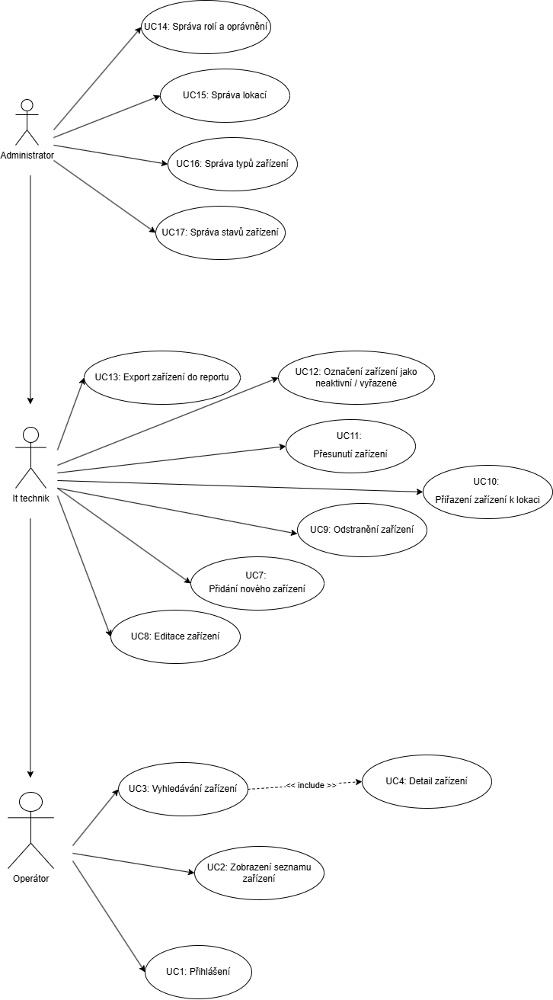

# Funkční specifikace

## Use Case diagram

## Seznam UsaCase

### Operátor
- UC1: Přihlášení
- UC2: Zobrazení seznamu zařízení
- UC3: Vyhledávání zařízení
- UC4: Detail zařízení

### It Technik
- UC7: Přidání nového zařízení
- UC8: Editace zařízení
- UC9: Odstranění zařízení
- UC10: Přiřazení zařízení k lokaci
- UC11: Přesunutí zařízení
- UC12: Označení zařízení jako neaktivní / vyřazené
- UC13: Export zařízení do reportu

### Administrator
- UC14: Správa rolí a oprávnění
- UC15: Správa lokací
- UC16: Správa typů zařízení
- UC17: Správa stavů zařízení

# Popis případů užití

### UC7: Přidání nového zařízení

- **Název:** Přidání nového zařízení
- **Kontext:** IT technik získal nové hardwarové zařízení (např. notebook, monitor, server) a potřebuje jej zaevidovat do systému.
- **Primární aktér:** IT Technik
- **Předpoklad:**	IT Technik je přihlášen a má práva pro přidávání zařízení.
- **Minimální záruka:**	Chybové hlášky při selhání validace (např. chybějící sériové číslo, neplatný typ zařízení).
- **Záruka úspěchu:**	Nové zařízení je úspěšně uloženo do databáze a je aktivní s přiděleným inventárním číslem.
- **Trigger:**	IT Technik stiskne tlačítko "Přidat zařízení".

### Hlavní scénář (Úspěšný tok)
1. IT Technik naviguje do sekce "Správa zařízení".

2. IT Technik klikne na tlačítko "Přidat nové zařízení".

3. Systém zobrazí formulář pro zadání detailů zařízení.

4. IT Technik vyplní všechna povinná pole: Sériové číslo, Název/Model, Typ zařízení (vybere z předdefinovaného seznamu - viz UC16), Stav zařízení (nastaví na "Nové/Aktivní") (viz UC17), Datum pořízení

5. IT Technik potvrdí formulář kliknutím na "Uložit zařízení".

6. Systém validuje zadaná data, vygeneruje interní inventární číslo a uloží záznam do databáze.

7. Systém přesměruje IT Technika zpět na detail nově přidaného zařízení a zobrazí mu hlášku o úspěšném uložení.

### Alternativní scénař
1. IT Technik naviguje do sekce "Správa zařízení".

2. IT Technik klikne na tlačítko "Přidat nové zařízení".

3. Systém zobrazí formulář pro zadání detailů zařízení.

4. IT Technik vyplní všechna povinná pole: Sériové číslo, Název/Model, Typ zařízení (vybere z předdefinovaného seznamu - viz UC16), Stav zařízení (nastaví na "Nové/Aktivní") (viz UC17), Datum pořízení

5. IT Technik vyplní sériové číslo, které již existuje v databázi.

6. IT Technik potvrdí formulář kliknutím na "Uložit zařízení".

7. Systém provede validaci a zobrazí chybu: "Zařízení s tímto sériovým číslem je již zaevidováno (Inventární číslo: [číslo])."

8. IT Technik opraví sériové číslo.

9. IT Technik potvrdí formulář kliknutím na "Uložit zařízení".

10. Systém validuje zadaná data, vygeneruje interní inventární číslo a uloží záznam do databáze.

11. Systém přesměruje IT Technika zpět na detail nově přidaného zařízení a zobrazí mu hlášku o úspěšném uložení.

### UC10: Přiřazení zařízení k lokaci
- **Název:** Přiřazení zařízení k lokaci
- **Kontext:** IT Technik fyzicky umístil zařízení na konkrétní místo a potřebuje tuto informaci zaznamenat do inventáře.
- **Primární aktér:** IT Technik
- **Předpoklad:**	IT Technik je přihlášen, má práva a Lokace (viz UC15) i Zařízení (viz UC7) musí být již zaevidovány v systému.
- **Minimální záruka:**	Chybové hlášky při neexistenci zařízení nebo lokace.
- **Záruka úspěchu:**	Záznam zařízení je aktualizován a obsahuje platné ID lokace.
- **Trigger:**	IT Technik klikne na tlačítko "Přiřadit lokaci".

### Hlavní scénář 
1. IT Technik naviguje na detail konkrétního Zařízení (např. přes vyhledávání).

2. IT Technik klikne na funkci "Přiřadit lokaci".

3. Systém zobrazí dialogové okno s polem pro výběr lokace (např. stromová struktura budov / kanceláří).

4. IT Technik vybere cílovou lokaci (např. "Budova A / Kancelář 305").

5. IT Technik potvrdí výběr kliknutím na "Uložit přiřazení".

6. Systém ověří platnost lokace a aktualizuje záznam Zařízení v databázi o nový odkaz na lokaci.

7. Systém zobrazí potvrzovací zprávu a na detailu zařízení se nyní zobrazuje nová adresa lokace.

### Alternativní scénář (Lokace je již obsazena)
1. IT Technik naviguje na detail konkrétního Zařízení (např. přes vyhledávání).

2. IT Technik klikne na funkci "Přiřadit lokaci".

3. Systém zobrazí dialogové okno s polem pro výběr lokace (např. stromová struktura budov / kanceláří).

4. IT Technik vybere cílovou lokaci (např. "Budova A / Kancelář 305").

5. IT Technik potvrdí výběr kliknutím na "Uložit přiřazení".

6. Systém zjistí, že vybraná lokace je již označena jako plně obsazená nebo rezervovaná.

7. Systém zobrazí varovnou zprávu: "Lokace [název] je aktuálně plně obsazena. Přejete si přesto pokračovat?"

8. IT Technik potvrdí, že chce přiřazení provést.

9. Systém ověří platnost lokace a aktualizuje záznam Zařízení v databázi o nový odkaz na lokaci.

10. Systém zobrazí potvrzovací zprávu a na detailu zařízení se nyní zobrazuje nová adresa lokace.

### UC15: Správa lokací
- **Název:** Správa lokací (CRUD)
- **Kontext:** Administrátor potřebuje přidat novou budovu/kancelář, editovat název stávající lokace nebo odstranit neexistující lokaci.
- **Primární aktér:** Administrator
- **Předpoklad:**	Administrátor je přihlášen a má práva pro správu lokací.
- **Minimální záruka:**	Chybové hlášky při pokusu o odstranění aktivní lokace nebo duplicitní název lokace.
- **Záruka úspěchu:**	Seznam lokací je správně aktualizován.
- **Trigger:**	Administrator naviguje do sekce "Správa lokací".

### Hlavní scénář (Přidání nové lokace)
1. Administrátor naviguje do sekce "Správa lokací".

2. Administrátor klikne na tlačítko "Nová lokace".

3. Systém zobrazí formulář s polem pro název lokace (např. "Budova C", "Sklad 2") a volitelná pole pro detail.

4. Administrátor vyplní název a potvrdí "Uložit".

5. Systém ověří unikátnost názvu lokace a uloží nový záznam.

6. Systém se vrátí na seznam lokací a zobrazí hlášku o úspěšném přidání.

### Alternativní scénář A (Odstranění aktivní lokace)
1. Administrátor najde v seznamu lokaci a klikne na "Odstranit".

2. Systém zjistí, že k této lokaci je stále přiřazeno aktivní zařízení (např. 5 notebooků).

3. Systém zobrazí chybu: "Tuto lokaci nelze odstranit. Nejprve je nutné přiřadit všechna zařízení (5 ks) k jiné lokaci."

4. Administrátor je vyzván, aby buď přeřadil zařízení (viz UC11), nebo akci zrušil.